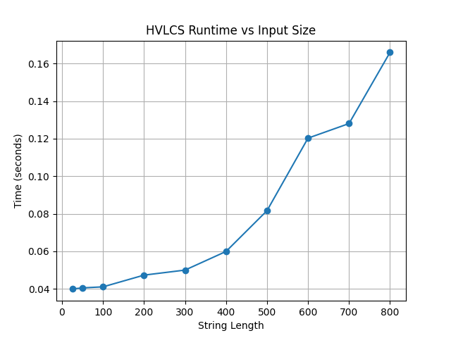

# Programming Assignment 3: Highest Value Common Subsequence
**Names:** Peyton Hecht (99580280), Adi Chauhan (78721054)  
**Course:** COP4533  
**Date:** April 6, 2026  

---

**Execution Instructions:**  
Navigate to the root directory of this repository in terminal. Run the `hvlcs.py` script located in the `src` folder, and pass the path to your input file as a command-line argument.

**Example Command:**
```bash
python src/hvlcs.py data/example.in
```

---

## Problem 1: Empirical Comparison

The runtime grows as string length increases, consistent with the expected O(m×n) behavior.

**Results:**
| Test File | String Length | Runtime (seconds) |
|-----------|--------------|-------------------|
| test1.in  | 25           | 0.0399            |
| test2.in  | 50           | 0.0405            |
| test3.in  | 100          | 0.0411            |
| test4.in  | 200          | 0.0473            |
| test5.in  | 300          | 0.0500            |
| test6.in  | 400          | 0.0599            |
| test7.in  | 500          | 0.0817            |
| test8.in  | 600          | 0.1203            |
| test9.in  | 700          | 0.1280            |
| test10.in | 800          | 0.1659            |

